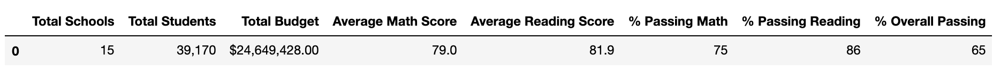
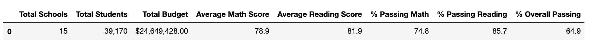
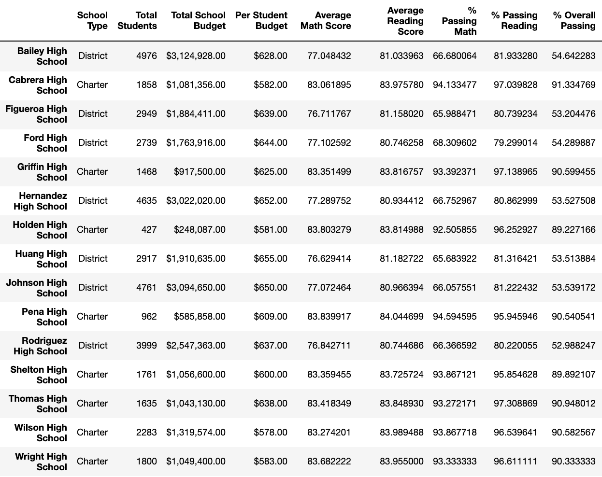
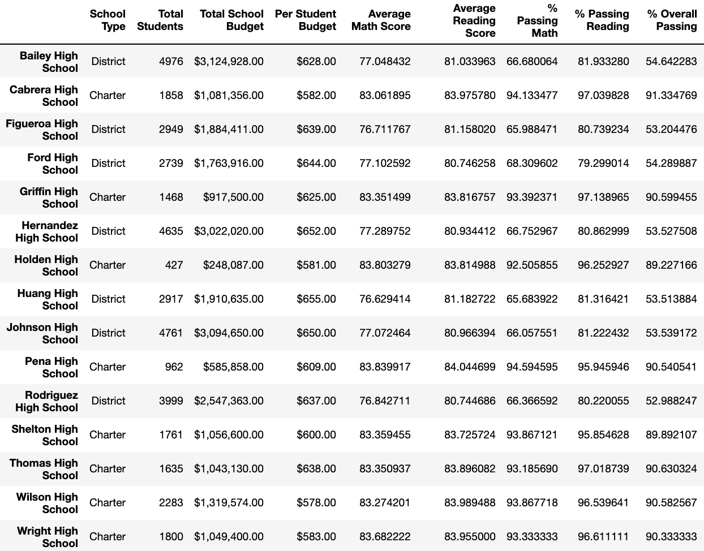
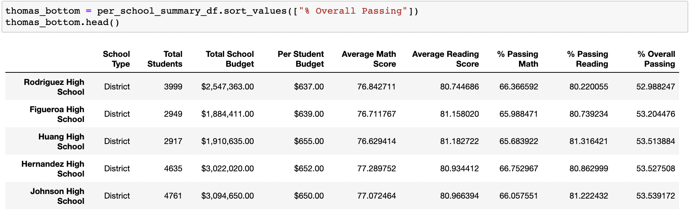
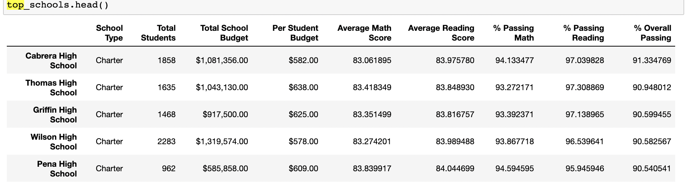
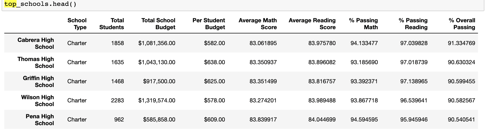
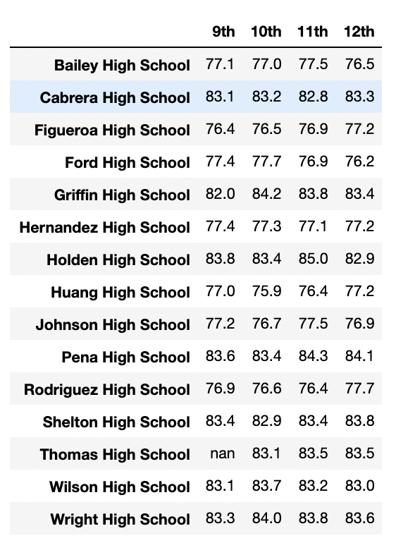
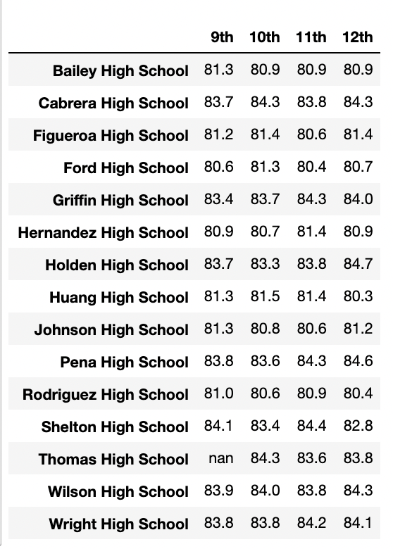

# School_District_Analysis

## Overview

We are asked to analyze the testing data for a school district's standardized testing. The analysis is intended to help inform the school board about how class size, monetary budget, and category of school factors into the test results received. It has been reported that in our data set there may have been cases of academic dishonesty within the 9th graders at Thomas High School. We are asked to replace all 9th grade scores for reading and math with NaN and to replicate our analysis without any scores that may have been cheated.

## Resources

Files: students_complete.csv, schools_complete.csv
Software: Python 3.7.6, Jupyter Notebook

## Results

Through our analysis we uncovered the following information:

### District Summary:
    - The dataframe shows a minor overall drop in the scores and percentages for both math and reading when eliminating the instances of possible academic dishonesty. Particul See below sreenshots with 9th graders at Thomas High School included as the first image.

    - We can see that students on average scored higher and had higher passing rates with reading than with math. Additionally, the overall passing rate is lower than either of the rates for math or reading. This is likely due to students mastering one skill, be it math or reading, and being unable to master the other. Based on this analysis it I would assume that educational focus should remain equally geared to both math and reading (perhaps with a slight emphasis on math, as the pass rate for math is lower than reading).

### School Summary:
- Looking at both analyses of the data there were only slight changes in the dataframe with regards to Thomas High School and removing 9th grade scores as seen in the screenshots below.

- We can also see that Cabrera High School is the top performing school for overall passing scores in both math and reading in the district. However, this is not to say that it is the top performing in terms of scores for math and reading. The average math and reading scores are below other schools in the district. However, Cabrera High School does boast the highest amount of students to receive scores of 70 or above for both math and reading.

#### How does replacing the ninth graders’ math and reading scores affect Thomas High School’s performance relative to the other schools?
- When we replaced the 9th graders' math and reading scores with NaN, Thomas High School's performance relative to the other schools dropped significantly as seen in the first screenshot below. Thomas High School is now the bottom most performing school. However, this is because the 9th graders' scores and student count are being taken into consideration when calculating the math, reading, and overall percentages.

- To fix this, later on in the code we made our count of students for Thomas High School and their scores only include 10th through 12th graders. This placed Thomas High School back as the 2nd highest performing school, which is not much different from the math, reading, and overall percentages they received prior to removing the 9th graders' scores. This is seen in the following screenshots, first showing the top 5 schools prior to removing 9th graders and second showing the top 5 after counting 10th through 12th only.

#### How does replacing the ninth-grade scores affect the following:
- Math and reading scores by grade:
    - As seen below, the math and reading scores by grade for every other school and grade number remained unchanged only affecting the 9th graders at Thomas High School. As we can see both scores were replaced with NaN for the entire class.

   
- Scores by school spending:
    - The scores by school spending changed significantly by increasing the `$585-629` bucket prior to the data cleaning after removing the replacing the scores with NaN. However, once we cleaned the dataframe to only include 10th to 12th graders, the results of scores by school spending remained rather unchanged from the dataframe that included all ninth grade scores.
    
- Scores by school size
    - The scores by school size changed slightly prior to the data cleaning after removing the replacing the scores with NaN. However, once we cleaned the dataframe to only include 10th to 12th graders, the results of scores by school size remained rather unchanged from the dataframe that included all ninth grade scores.
- Scores by school type
    - The scores by school type changed slightly prior to the data cleaning after removing the replacing the scores with NaN. However, once we cleaned the dataframe to only include 10th to 12th graders, the results of scores by school type remained rather unchanged from the dataframe that included all ninth grade scores.
    
## Summary
There were several minor and major changes made in our updated school district analysis. Of the major changes the following are the most significant:
1. By far the most important change we made to our school district analysis is changing the math and reading scores for every ninth grader at Thomas High School to a value of `NaN`.
2. We changed the average math and reading scores for Thomas High School to only reflect the average for the students in 10th to 12th grade.
3. We calculated the total number of students in 10th to 12th grade at Thomas High School, excluding the 9th graders, so that we can calculate the percentages against this new number for a more accurate passing percentage for math, reading, and overall passing. We also used the new average math and reading scores when calculating each of the percentages as well.
4. We replaced Thomas High School's values for `Average Math Score`, `Average Reading Score`, `% Passing Math`, `% Passing Reading`, `% Overall Passing` in the `per_school_summary_df` with the new values received by only counting 10th through 12th graders' scores.